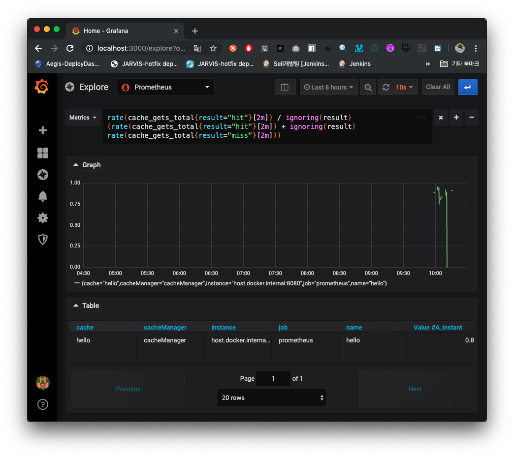

# 개요
Spring Boot2.1 버전에서 Caffeine Cache의 사용법을 간단하게 익히고,
Spring Boot Actuator + Prometheus + Grafana 로컬 대쉬보드 환경 구축을 위한 셋팅

Grafana에서 Explore를 통해 [PromQL](https://prometheus.io/docs/prometheus/latest/querying/basics/)을 학습 하자!
# 사전 설치
* JDK11
* Docker

# 시작

1. Spring Boot 실행
```sh
./gradlew
```

2. Local DashBoard를 띄우기 위한 docker-compose 실행
```sh
docker-compose -f src/main/docker/docker-compose.yml up -d
```

3. 확인 
Prometheus : http://localhost:9090
Grafana : http://localhost:3000
Spring Boot : http://localhost:8080


예제 캐시 히트율 구하기
```
rate(cache_gets_total{result="hit"}[2m]) / ignoring(result) (rate(cache_gets_total{result="hit"}[2m]) + ignoring(result) rate(cache_gets_total{result="miss"}[2m]))
```